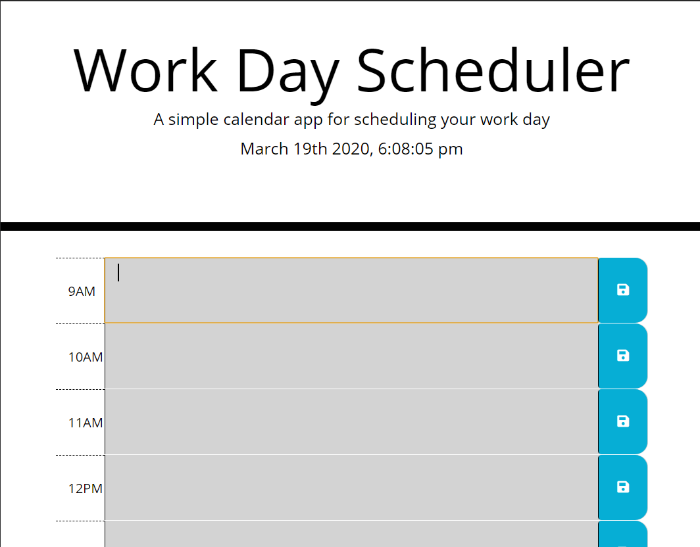

# planner Project Name
> planner

## Table of contents
* [General info](#general-info)
* [Screenshots](#screenshots)
* [Setup](#setup)
* [Status](#status)
* [Contact](#contact)

## General info
This is a basic browser program used to help users save their busy schedules. The planner uses moment.js API to tell the time of day and adjust the planner accordingly. The planner also utilizes local storage to save the data a user has previously entered.

## Screenshots

## Setup
This program runs in browser. There is no installation needed.

## Code Examples
timeBlockElements.each(function(){

    var timeBlock = parseInt(this.id.split("-")[1]);
    
// get the hour of the block
    var description = hoursData[timeBlock.toString()];

    // in hours data object
    // get the text area 
    $(this).find("textarea").val(description);

    // find current time
    // if current

    if (timeBlock < currentHour){
        // give past class to hour
        $(this).addClass("past")
    } else if (timeBlock === currentHour){
        // give present class to the hours
        $(this).addClass("present")
    } else {
        // give future class to hour
        $(this).addClass("future")
    }
})
This is a block of code that color codes the "time blocks" based on the time of day. If the time of day has already passed, the color is grey, if it is currently that time, the color is green. If it is neither of those, meaning that time is still to come, the color is red.

## Status
Project is in progress. Feel free to email me with any suggestions or to report any bugs: ianmharris93@gmail.com

## Contact
Created by Ian Harris(https://github.com/iannm93) - ianmharris93@gmail.com - feel free to contact me!
